# Державний вищий навчальний заклад Ужгородський національний університет Факультет інформаційних систем та технологій

# ЛАБОРАТОРНА РОБОТА №3
### Тема: Docker.

Виконав студент 3 курсу
Напрям: ІСТ
Майор Дмитро

#### План:
- Використання готових Docker Images.
- Використання Docker Compose.
- Створення HTML сторінки та занесення її в Docker Image. Залити даний Docker Image на Docker Hub.
- Скачати Docker Image когось із групи і розвернути в себе контейнер з HTML сторінкою на порті 8086 ззовні.

#### Виконання:
- Використання готових Docker Images.
  
  Ознайомився та встановив образ wordpress.
  
  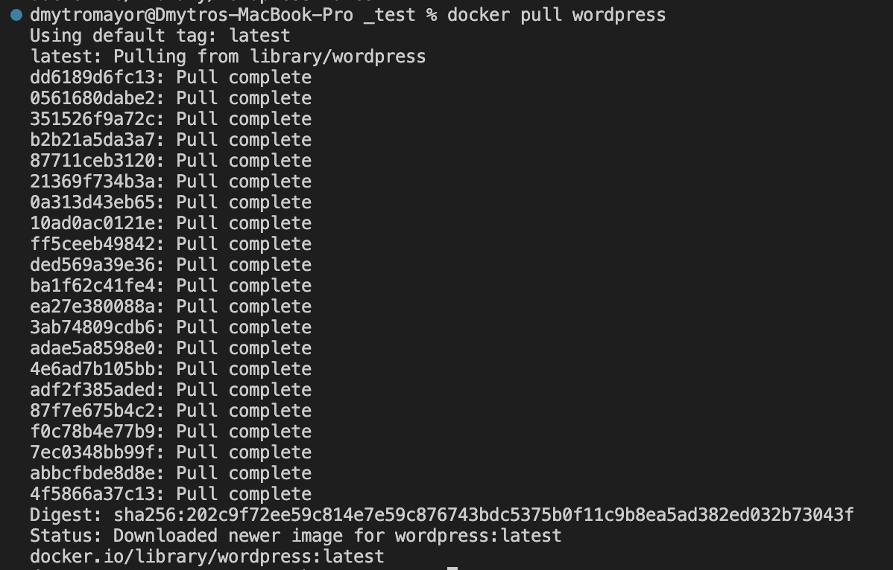

  Створив файл docker-compose.yml та скопіював в нього текст з прикладу на сторінці wordpress на Docker Hub.

  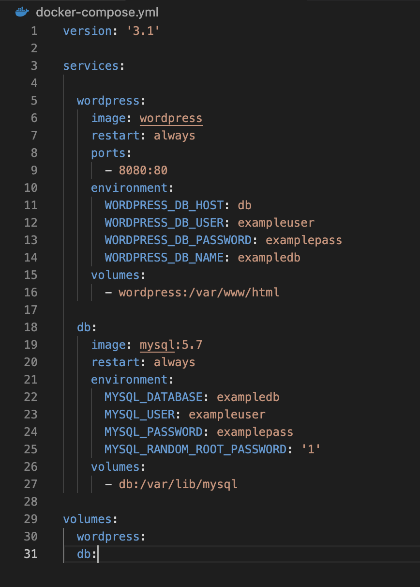
  
  Після запуску wordpress, ввійшовши в аккаунт адміна, встановив іншу тему для сайту.
  
  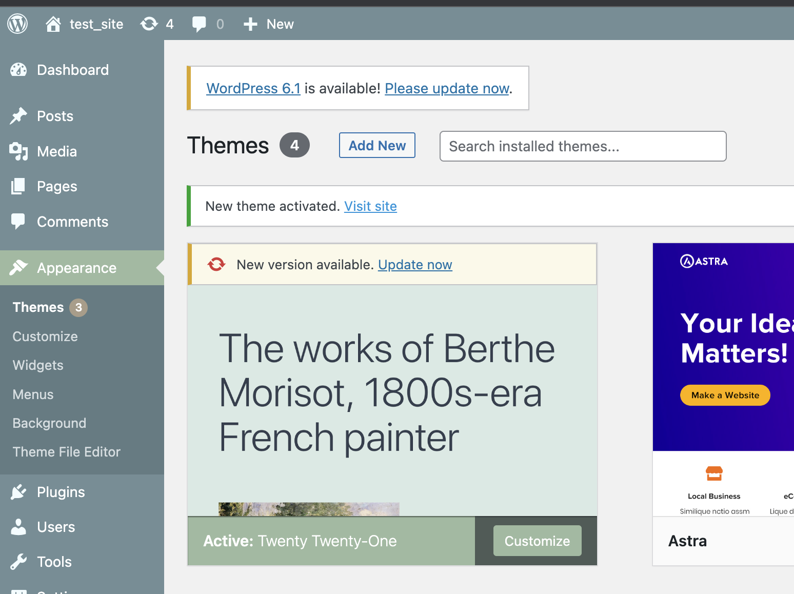
  
  Отримав наступний результат:

  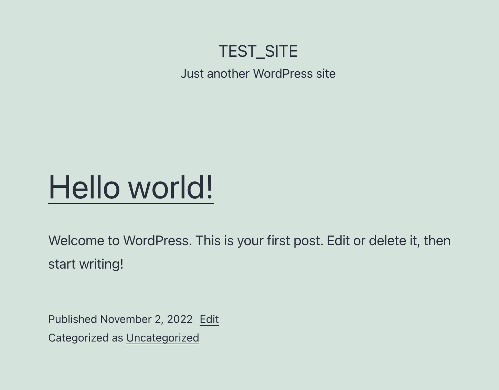
  
- Використання Docker Compose.

  Docker Compose - інструмент для запуску та керування мультиконтейнерними додатками. Він допомагає створити ізольоване середовище (пісочницю), у якому містяться всі необхідні залежності. Одним з найпоширеніших застосувань YAML є створення конфігураційних файлів. Рекомендується записувати конфігураційні файли у форматі YAML, а не JSON, хоча в більшості випадків вони можуть використовуватися як взаємозамінні, оскільки YAML має кращу читабельність і є більш зручним для користувача. До проблем YAML можна віднсети те, що при написанні YAML-коду слід дотримуватися додаткових заходів обережності. Навіть якщо ви не співпаде один пробіл під час відступу, ваш код може перестати працювати.
  
  Приклад збирання та запуску за допомогою Docker Compose.
  
  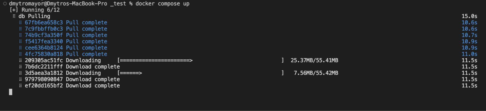
  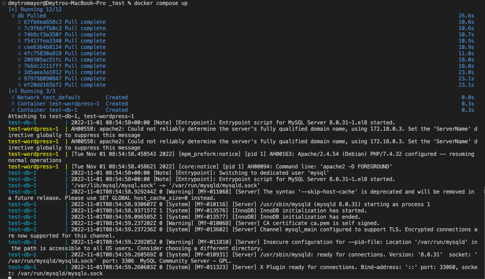
  
- Створення HTML сторінки та занесення її в Docker Image. Залити даний Docker Image на Docker Hub.

  Створив наступний html файл в папці src.

  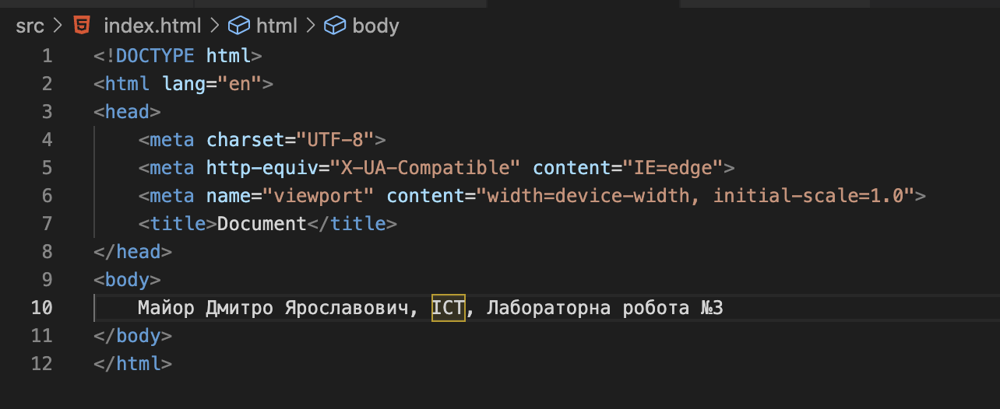
  
  Створив наступний Dockerfile.
  
  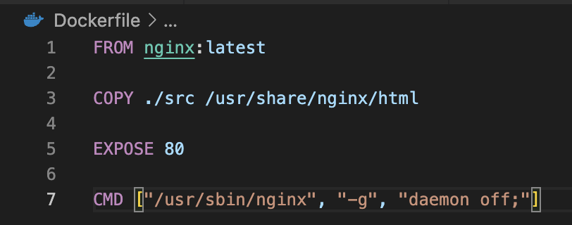
  
  Збудував Docker Image.
  
  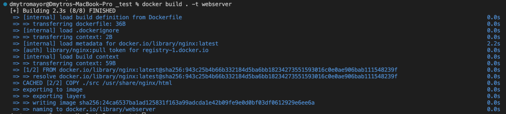
  
  Та запустив.
  
  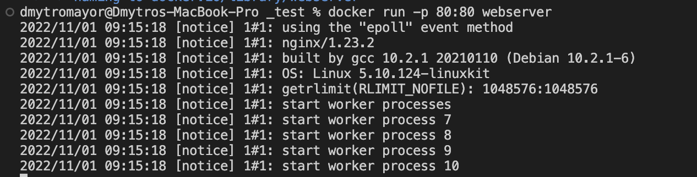
  
  Переконався що все працює.

  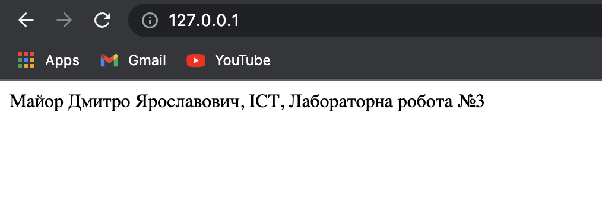
  
  Змінив тег та запушив на Docker Hub свій Image.

  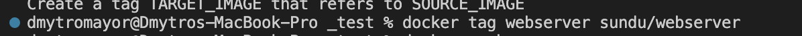
  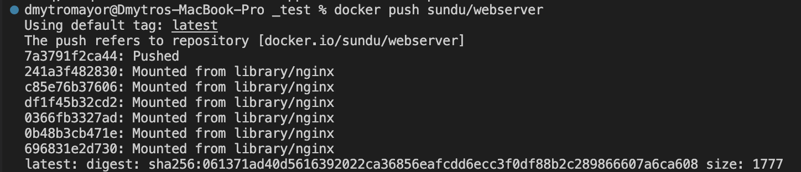
  
  Image розміщений за наступним посиланням: https://hub.docker.com/repository/docker/sundu/webserver
  
- Скачати Docker Image когось із групи і розвернути в себе контейнер з HTML сторінкою на порті 8086 ззовні.

  Скачав Image однокурсника та запустив на зовнішньому порті 8086.

  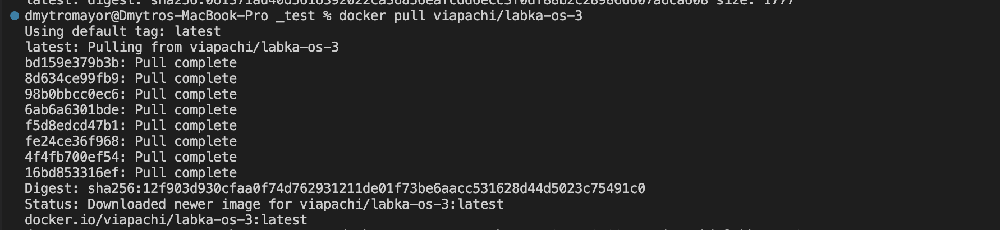
  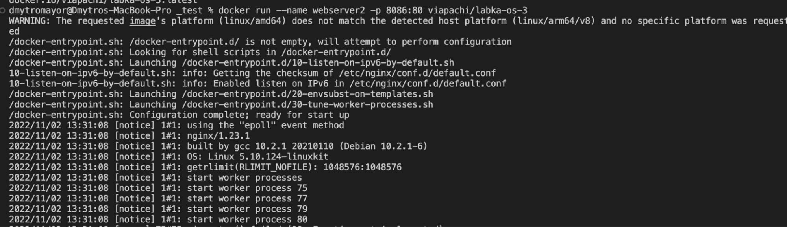
  
  Перевірив чи все працює.	
  
  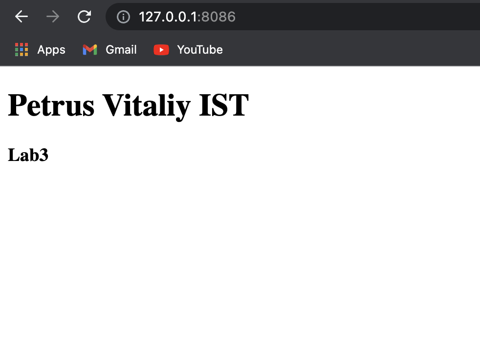

###Висновок
На даній лабораторній роботі я ознайомився з командами Docker та Docker Compose та використав їх на практиці. Створив файл docker-compose.yml та використав його для побудови образів й запуску контейнерів. Навчився керувати образами та контейнерами за допомогою команд Docker. Навчився користуватись Docker Hub. У результаті отримав образ контейнеру вебсерверу який вміє відображати html файл. Оформив звіт з додаванням скріншотів.

  
  
